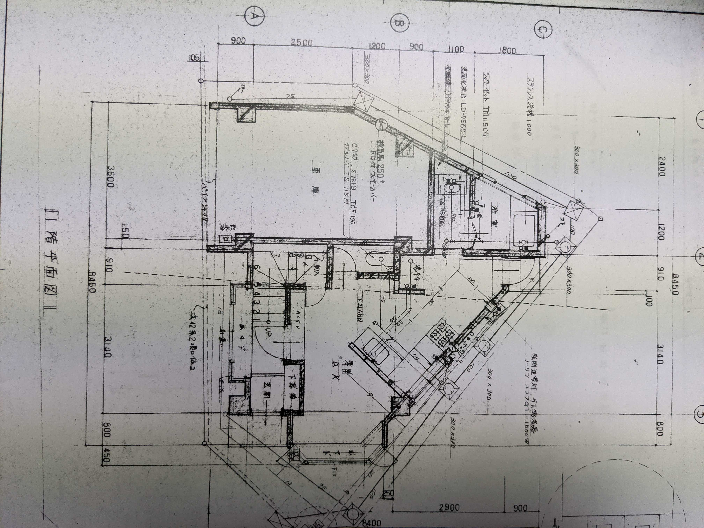
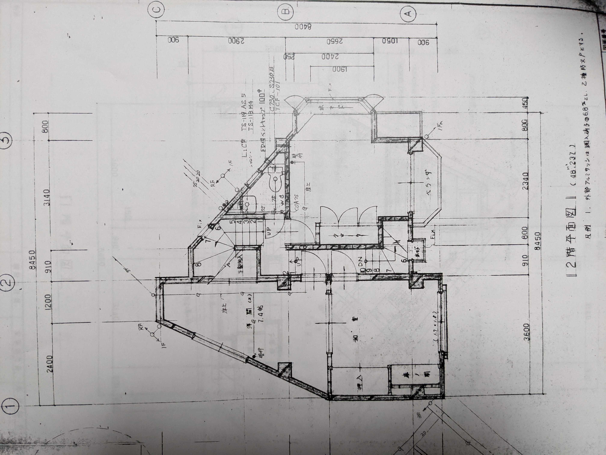
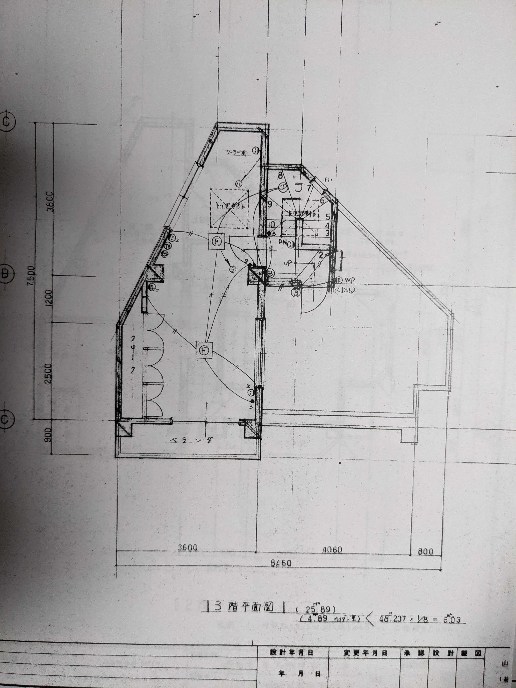
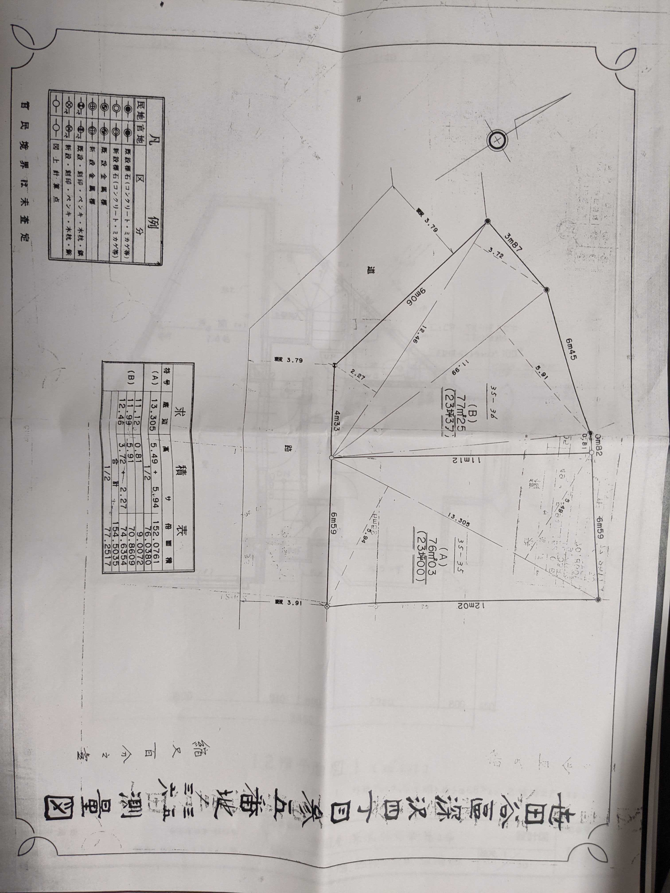

# まとめ

# 1階
  * [玄関](1階/玄関.md)
  * [風呂](1階/風呂.md)
  * [脱衣所](1階/脱衣所.md)
  * [トイレ](1階/トイレ.md)
  * [洗面台](1階/洗面台.md)
  * [階段](1階/階段.md)
  * [父の寝室](1階/父の寝室.md)
  * [母の寝室](1階/母の寝室.md)

# 2階

  * [ダイニング](2階/ダイニング.md)
  * [バルコニー](2階/バルコニー.md)
  * [キッチン](2階/キッチン.md)
  * [パントリー](2階/パントリー.md)
  * [階段](2階/階段.md)

# 3F

  * [主寝室](3階/主寝室.md)
  * [子供部屋](3階/子供部屋.md)
  * [トイレ](3階/トイレ.md)
  * [洗面所](3階/洗面所.md)

# その他
  * [間取り](その他/間取り.md)
  * [外観](その他/外観.md)
  * [西側について](その他/西側について.md)
  * [宅配BOX](https://images.app.goo.gl/oEbhnVwYewpP8vKE8)

  * [半地下収納](その他/半地下収納.md)
  ⇒長期優良物件から外れる且つ、費用が高い事からやめる。

# 条件と機能
  * 人感センサー
  * 長期優良住宅
  * 太陽光発電(費用次第)
  * 蓄電池(費用次第)

